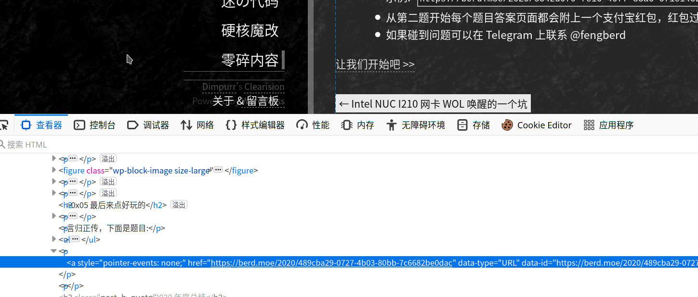

## 剧情前提

<TelegramEmbed link="liyuans/36350" />


在Leonn的博客频道看到这个, https://blog.berd.moe/archives/2020-review/

感觉博主是个~~肝帝~~很强的人, 那就做一下题目试试看吧


## 流程

每个题目网页上都会有个hint

### Problem 0



Style 上面被加了 `pointer-events: none;`. 去掉或者直接复制链接就好了

https://berd.moe/2020/489cba29-0727-4b03-80bb-7c6682be0dac

### Problem 1

一只方熊猫

思路: https://ctf-wiki.github.io/ctf-wiki/misc/picture/png-zh/

在Linux上CRC校验失败是直接看不到的, 我一开始用 `binwalk` 找了好久, 然后注释里面的方熊猫搜索了好久  
直到最后看到上面这个地方才意识到`panda.png`的比例不是方的

```
DECIMAL       HEXADECIMAL     DESCRIPTION
--------------------------------------------------------------------------------
0             0x0             PNG image, 864 x 432, 8-bit/color RGBA, non-interlaced
41            0x29            Zlib compressed data, default compression

```

使用 `hexedit` 将 `[20:24]` 处改为 `00 00 03 60` 即可 (因为已经告诉你是正方形的了啊)


修改后的文件头:  
```
0000000 5089 474e 0a0d 0a1a 0000 0d00 4849 5244
0000010 0000 6003 0000 6003 0608 0000 4a00 0b92
```

图片中flag打入即可

### Problem 2

```
http://arealexistingdomain/flag.html
```

链接很明显不是一个正常的域名, 但是说实话我也不知道什么地方可以解析这个域名, 于是我直接

```bash
curl http://berd.moe/flag.html -H 'Host: arealexistingdomain' 
```

作者也说了, 应该解析到另外一个服务器上的, 确实这样在这里我可能就放弃了(hhh)

那我就直接复制作者原话作为解析好了

> 这是一个 Handshake 域名: https://www.namebase.io/domains/arealexistingdomain  
> 但是 HNS.TO 不知道为什么无法正常解析, 必须使用 HSD 或者 HNSD 才能解析

### Problem 3

粗心的小明

1. 看到题目想着可能是`aes-256-cfb`某个漏洞, 因为`key`是确定的, 而且我们应该知道第一个block的数据`red_envelop_2021`  
2.  但是搜索了一下发现`iv`不正确只会影响解密后的第一个 block, 后续的都是正常的  
3. 并且一个block因为是`json`后的结果, 只是`key`解密不正常  
4. 但无所谓啊, 我们只要`value`
5. 直接从网上随便复制了一段解密的代码, 放到 runkit.com 跑了一下

```js
const fs = require('fs');
const uuid = require('uuid');
const crypto = require('crypto');

let red_envelope_2021 = uuid.v4();

JSON.stringify({
    red_envelope_2021
});

const algorithm = 'aes-256-cfb';
const secretKey = crypto.scryptSync('xiaomingSecureKey2021', 'xiaomingSuperSalt', 32);
const iv = crypto.randomBytes(16);

const encrypt = (text) => {
    const cipher = crypto.createCipheriv(algorithm, secretKey, iv);
    const encrypted = Buffer.concat([cipher.update(text), cipher.final()]);
    return {
        iv: iv.toString('hex'),
        content: encrypted.toString('hex')
    };
};

const decrypt = (hash) => {
    // iv doesn't matter, use whatever value it generated
    const decipher = crypto.createDecipheriv(algorithm, secretKey, iv);
    const decrpyted = Buffer.concat([decipher.update(Buffer.from(hash, 'hex')), decipher.final()]);
    return decrpyted.toString();
};

let h = "d365895fbcdbd3a29b1bf00307429fd07d53ba3c0553b8789867d4aee3b8c3bbb0e5a8fd582a9696aabbdc1e373f97efac2529d588320800449553f6"

decrypt(h)
```

输出:  
```
"���J�Ŋ\u0010�HI�K?&�021\":\"36b9c3df-ac74-46a1-8ca1-66b24274a7dd\"}"
```

### Problem 4

🆒

<pre>
{{ cool_file }}
</pre>

首先我得说, 这个题目对Linux有点不友好, [🆒](https://gitlab.com/fogity/squared-cool) 是一个只能用emoji写的语言, Linux的emoji支持...

~~反正我最后找了macbook做, 但是就算是mac也有时候显示不对~~

提示里面写了`esolang`, 但是我一开始搜索到了 https://esolangs.org/wiki/Emoji , 但实际上应该是 https://esolangs.org/wiki/%F0%9F%86%92


~~后面我觉得不对, 研究了一会用文件中看起来像是`keyword`的部分重新搜索了才找到这个~~

但是问题是直接执行文件会解释器提示文件中有非emoji, 研究了一会实在解决不了, 直接用 [Scheme](https://racket-lang.org/) 重新写了一个

```rkt
#lang r5rs

(define (firstfunc a b c d e f)
    (begin
        (display a)
        (display b)
        (display c)
        (display d)
        (display e)
        (display f)
   )
)

(define (secondfunc userinput a b c d e f g h i)
    (if 
        (>= (* (/ userinput 1847) 4) 248)
        (begin
            (firstfunc g i d f d c)
            (firstfunc d a d e h b)
        )
        (display "oops")
    )
)

(define (start input)
    (secondfunc input "9a94" "1974" "4️fc7️" "-" "b7️9️9" "8️a4️c" "d6️0️c" "2️5️e1️" "2️3️7️2️")
)

(start 114514)
```

Scheme版本的意思应该一目了然了, 满足条件以后拼接字符串

这题除了emoji替换有点头疼以外, 其他的意思理解都很简单


## 小结

确实还挺有意思的, 作者花了时间~~和钱~~在里面, 值得花点时间写个 `writeup`下来

~~其实是再难点估计我就放弃了~~

既然你都花时间看到这里了, Alipay{我就不搞什么花样了}, 支付宝口令红包 10个

最后祝大家新年快乐!

<script>
import TelegramEmbed from 'vue-telegram-embed'

export default {
    components: {
        TelegramEmbed
    }, 
    computed: {
        cool_file() {
            return require('../_assets/file/2020-red-pack-writeup/36b9c3df-ac74-46a1-8ca1-66b24274a7dd.cool')
        }
    }
}
</script>