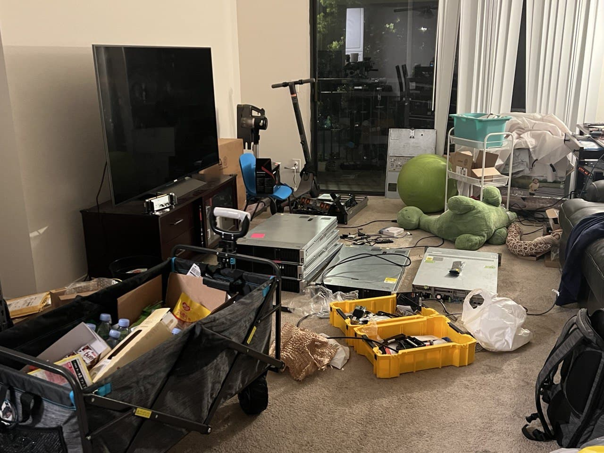

最近入手了一个很老的Cisco UCS C240 M3S机器，遇到了不少麻烦，记录的同时吐槽一下



## CMIC

3.0这个版本的CMIC还是在用Flash！但是还好因为Flash游戏的流行，有开源项目专门做浏览器帮助用户使用Flash。亲测 https://github.com/radubirsan/FlashBrowser 可用

### KVM

KVM的话，一般是Java，这个可以尝试用 [IcedTea-Web](https://github.com/AdoptOpenJDK/IcedTea-Web) 解决。

#### CMIC KVM

> https://community.cisco.com/t5/cisco-bug-discussions/cscvs11682-c220-c240-m3-server-need-html5-support-for-cimc-webui/td-p/4144939

> There is a workaround I was made aware of recently which uses the API on the UCS server to make a call directly to obtain the Java KVM console. I have tested this and although you don't get the GUI, you get the full console functionality (turn on/off, mount virtual images to upgrade, etc): 
> `https://<CIMC_IP>/kvm.jnlp?cimcAddr=<CIMC_IP>&tkn1=<CIMC_username>&tkn2=<CIMC_Password>`

可以通过直接访问API拿到JNLP，拿到以后信息不变可以反复使用，也可以直接编辑这个文件，里面的内容也挺直接的。里面是包含了账号密码的，要小心保管

#### SuperMicro KVM

SuperMicro的机器似乎会每次动态生成JNLP的验证，但是还好他们的网页不需要Flash。

## 更新固件

这个简直就是头大的不行。他们的firmware似乎是只提供HUU(Cisco UCS Host Upgrade Utility)，然后这个镜像如果直接做成U盘，每次都会卡死在906复制文件错误。试过了Rufus和DD直接写都不行，但是用`virtual media`挂载是可以的！太糙了，这是什么神奇操作……  

HUU不方便那就提取出来走Webui试试看好了，但是！他们的HUU提取是要用专门的程序`getfw`。他们的固件默认是加密打包好了的所以直接拆还挺麻烦的，但是这个程序真的emmm要求特别多：首先要`squashfs`，然后`openssl`版本要`1.0.1`e，然后还是直接从`PATH`读取的。要不是[这篇博客](https://blog.jamiescott.me/extract-cisco-ucs-firmware-from/)我真的要放弃了

### 错误提示

### Decryption failed

openssl版本不对

```bash
# Set up openssl
wget https://ftp.openssl.org/source/old/1.0.1/openssl-1.0.1e.tar.gz
tar -zxvf openssl-1.0.1e.tar.gz
cd openssl-1.0.1e
./config
make

sudo su
export PATH="/path/to/openssl-1.0.1e/apps:$PATH"
```

### Extraction Failed

如果你直接用本地正在mount的iso，拷贝单独的一份出来

### 更新CMIC

然后就是HUU更新有的时候还是不行，CMIC我当时直接更新还是失败

> 网页提示 `Error while updating: invalid file name CIMC`
> 然后remote http download百分之5直接reset
> HUU 提示自己内存不够是否确认重启CMIC

然后我发现HUU没有成功重启CMIC！我自己重启了一遍就好了，真的佛了

**多试试重启！！！**