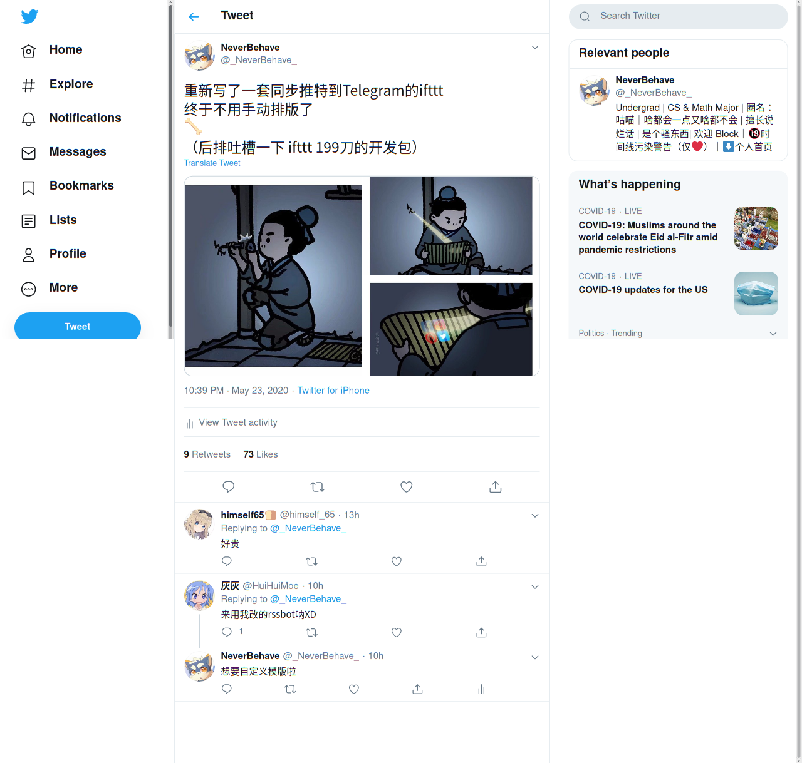
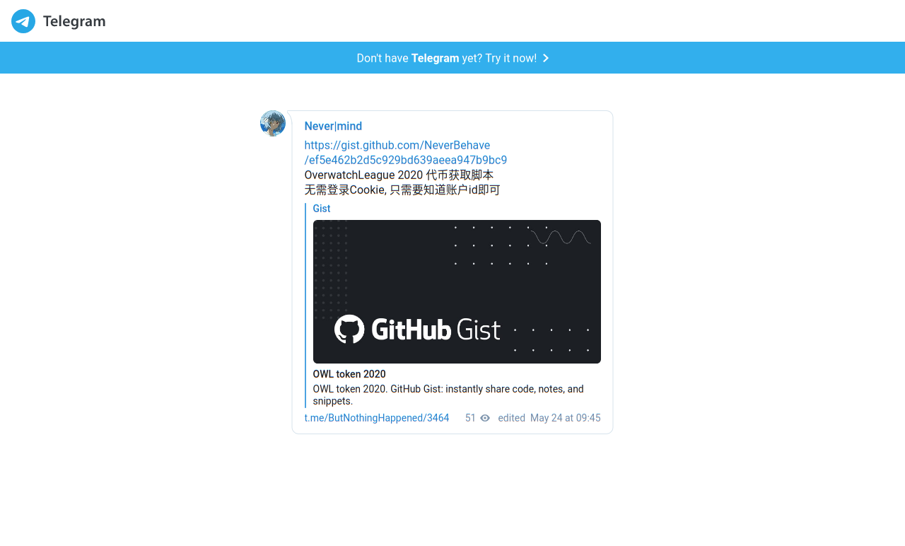
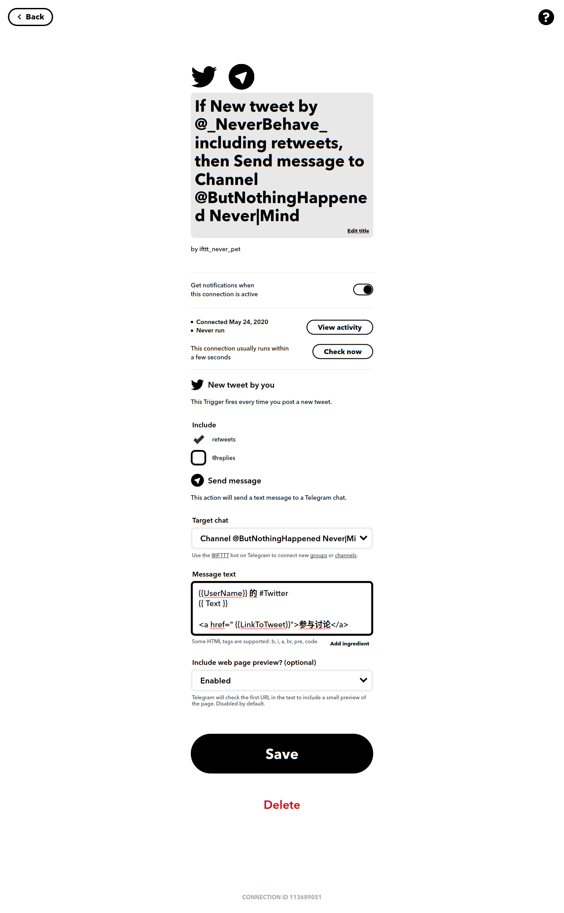
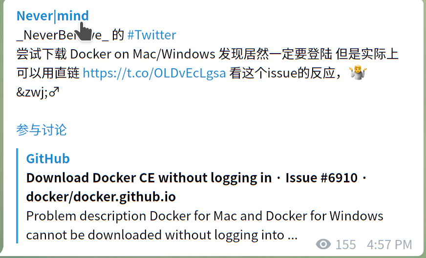
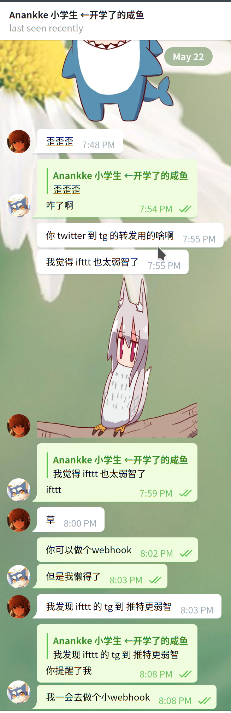
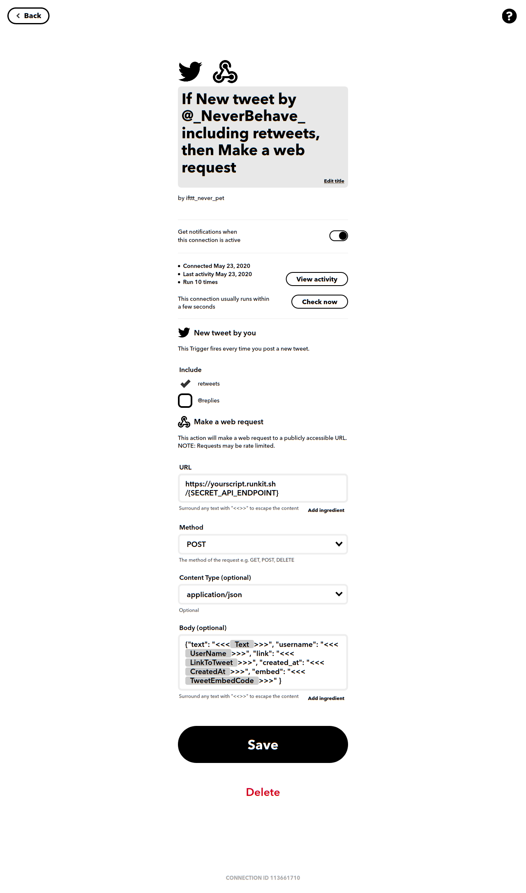
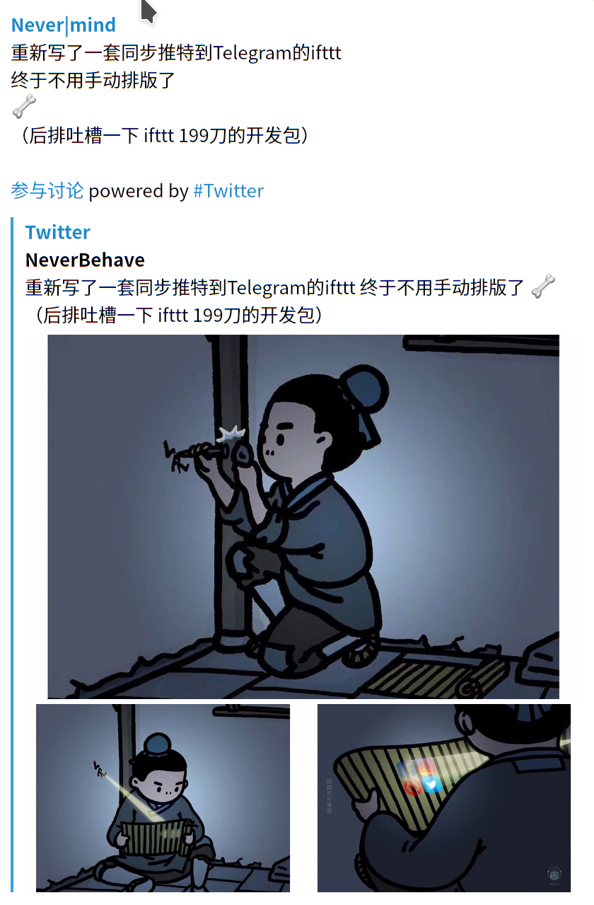

这大概是我最近最后一篇更新了, 马上要上班了, Orz

## 事故前提

我平时主要的两个发布 ~~(朋友圈)~~ 渠道, 一个是 [Twitter](https://twitter.com/_NeverBehave_), 另外一个则是 [Telegram Channel](https://t.me/ButNothingHappened)

很多时候这两个渠道发布的是相似的东西, 至少我希望是如此. 那这个时候肯定是能懒则懒, 在任一渠道发布的东西自动在其他渠道更新. 从 Twitter 到 Telegram, 或者是反过来. 两者我都尝试过了, 最后确定主要思路是从 Twitter 往其他渠道同步

### 为什么是 Twitter



大方向是, 在当时, Twitter 是更加主流的工具. 但同时我也有如下考量: 

- 网页内容展示较为友好
 
 Telegram 也有网页预览, 而且也很简洁, 但是相比与推特来说, 不会有一步跳转应用, 对于没有安装应用的人来说体验会稍微友好一点



- 自带评论

Telegram 在早期评论只能通过特定机器人发送带键盘的消息; 现在虽然说有官方版本, 但是是通过网页发送, 整体流程很繁琐, 而推特对此优化较好, 没有 Telegram Channel 那种僵硬的体验 

> 其实 Telegram Channel 根本当初就不是这样设计的吧

同时我也希望可以整合评论, 其他渠道发布时导流即可

- API & 长度限制

从我的角度出发, 我已经相当了解 Telegram 的 API 使用, 但是推特的在我看来过于繁琐. 

同时消息在推特的限制更多 (4图 + 长度限制), 如果导入需要更多的边缘情况处理.

### 目前的痛点 (ifttt)

在一开始, 我是直接使用的 ifttt 上的同步

大概设定如图



整体体验还行, 除了以下几点:

- `Text` 换行会变成空格, 估计是因为使用了`parse_mode: html`导致的, 这个无法更改
- 链接会被转换成 `t.co`, 在其他平台看起来效果不是很好
  - 对于图片, 会出现多条`t.co`链接在正文部分, 但是实际上 `page preview` 会直接从这条推文提取图片, 没有必要再次放入图片

> 就是没什么自由度呗, 除了字符串模板

所以效果是这样的



于是每次我还要手动发布推文后等同步手动修正空格问题, 删除或者替换多余跳转链接, 有点恼火

直到 [@anankke](https://blog.anank.ke) 提醒了我`webhook`的存在



## 正文

先确定一下架构:

因为我不想花钱钱, 我也不会发那么多推文, 于是我选用了 `runkit` 作为 webhook 的接收器, 对于我发推文的数量,  `runkit` 的限制绰绰有余
 
那么大概样子就是: 

```
ifttt -> runkit -> telegram api 
```

### Q&A

#### 为什么是webhook传出而不是传入

ifttt 的 webhook 传入 只能有一个`eventname`, 但是传出却可以带所有可以用到的参数

> 确实有点鸡肋

#### 为什么不用推特的API

不是没想过, 但是看完以后发现要额外管理一个key, 而且还想办法记录并筛选新的推文 (API是一次返回所有时间线的信息)

> ifttt 真香


### 准备工作

首先需要如下操作

- 对应发布的频道有一个管理员权限的机器人
  - 建议只给予发送消息的权限
- 绑定 ifttt 到你的推特


### Runkit Script

https://runkit.com/neverbehave/5ecac198b99072001340f3fe

1. 其中需要的环境变量有
- `TELEGRAM_BOT_TOKEN` 你的机器人`BOT_TOKEN`
- `SECRET_PATH` webhook 路径
    
    因为`runkit`上所有的`notebook`都是公开的, 只有可以搜索到和不可以搜索到, 不建议将`API KEY`直接写进代码. 同时知道`webhook`路径的人相当与变相获得了在频道发送消息的权限, 建议也使用`env`保护

    你可以在[这里](https://runkit.com/settings/environment)设置环境变量

    > 注意, 环境变量是全局的, 在你帐号下所有`Notebook`都将生效, 建议使用复杂一点的名字防止冲突

2. 同时也还需要修改第17行的`ChannelID`为你需要发送的位置

3. (可选) 修改59行的模板信息

4. 最后点击页面顶部`endpoint`即可获得永久`端点地址`

#### 这个脚本做了什么事情

- 提取所有`t.co`链接, 并替换成真实链接, 或者删除该链接如果其指向的是图片域名
- 按照模板向Telegram发送信息

### ifttt 设置




大致设置如图, 注意以下几点

1. `content-type`不要选错, 否则`escape`不会生效
  - 其中网页上的建议`escape`估计是有误, 使用`"<<<>>>"` 包裹证明是有效的
  - [参考](https://birdie0.github.io/discord-webhooks-guide/services/ifttt.html)
2. `webhook`路径是你`端点地址+设置的SECRET_PATH`


#### 为什么不分享你做的 `applet`

我也是才发现, ifttt 很久以前就停止的个人用户发布`applet`, 同时就算是 199刀的开发者套装, 居然也没有这个功能. 

总之现在操作很迷

#### 怎么调试

这也是我很头疼的地方, 我只能用最老套的方法发新推触发看结果. 

如果你刚好在这篇文章之前看到我发了又删的推几, 那应该就是我在调试`escape`的时候

## 效果

大概是这样



链接的自动转换没有体现出来, 但是至少空行的问题解决了, 自由度也高了很多

对于其他的内容, ifttt 的 webhook 也可以用相同的办法做到类似的东西, 就看大家发挥了