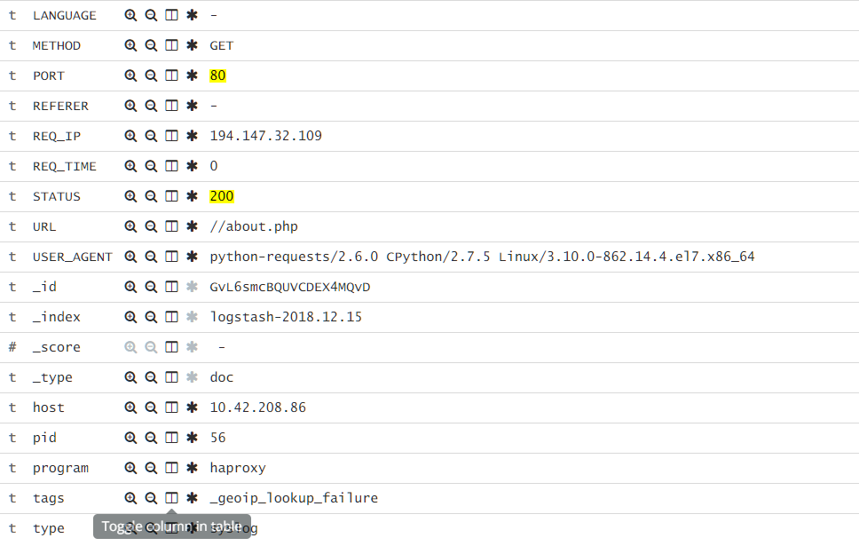
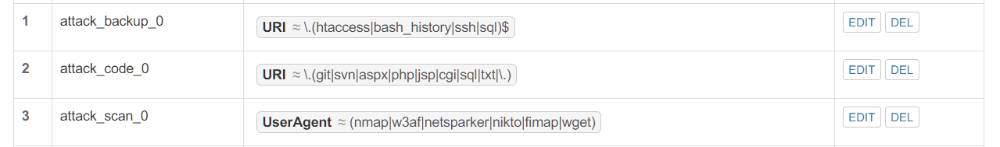
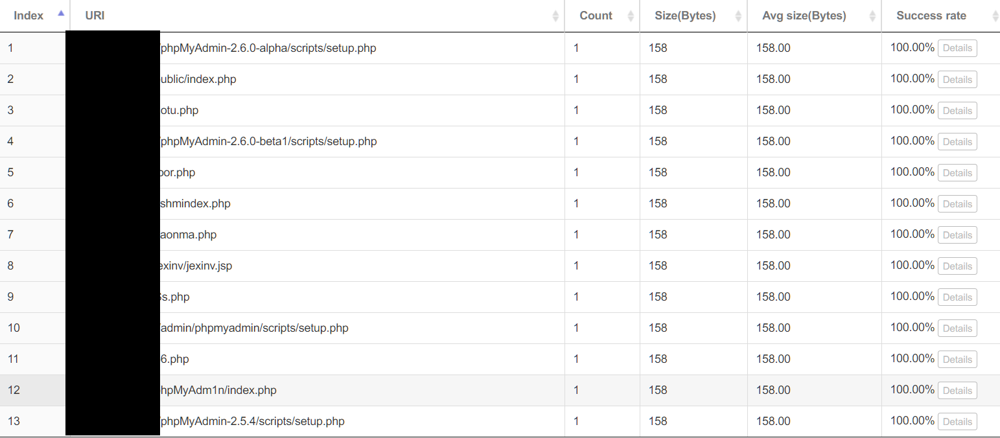
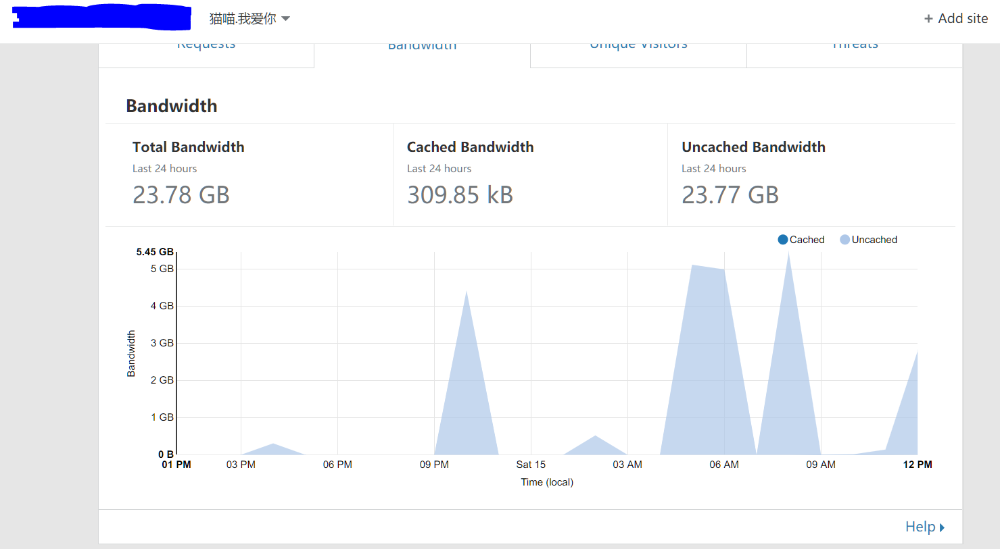
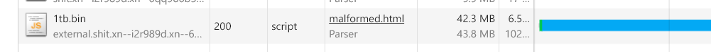

> 机器人在这里特指爬虫，本文特指一些通过扫默认目录尝试窥探 `phpmyadmin` 一类管理面板的玩意

最近翻看访问日志的时候发现 80 端口似乎有些异样：


都是什么狗屁.jpg 

因为自己平时也不用 80 走服务，主要都是 301 到 https，那么……为什么不给他们点好玩的呢？

## 动手时间

> 参考仓库：https://github.com/NeverBehave/BotBomb
> 首页：https://shit.xn--i2r989d.xn--6qq986b3xl/

思路很简单：直接在跳转之前判断一下，如果 `user-agent` 或者 `URL` 包含关键词直接返回构造好的请求

目前我的规则比较暴力，但是也比较有效，就是所有`.php|.cgi|.jsp|.aspx` 之类的直接弹，因为我不会用 `Plain Text` 暴露服务

至于说规则怎么加，一开始我是想着用 `nginx` 的规则直接加，但是管理起来确实不方便：[仓库](https://github.com/NeverBehave/docker-nginx-https-redirect/) 。所以我找到了以前一个还不错的项目 [VeryNginx](https://github.com/NeverBehave/VeryNginx)

> 因为原作者不再更新，这里我放上我的 Fork，可以很方便的配合 Docker 食用



配合目前的集群，所以大致关系如下：

```
        +---------------+      +---------------+    +----------------+
Expose  |    LB-Exit    +------>   VeryNginx   +---->   Redirector   |
 Port   |    Cluster    |      |               |    |                |
  80    |               <------+               <----+                |
        +---------------+      +---------------+    +----------------+
```
### Q&A

1. 为什么要加上一个`Redirector`?
	因为 `VeryNginx` 本身的限制，他的过滤顺序是：`Rewrite`，`Access`（这个限制是`Nginx`给`Lua`的，因为是在`Nginx`的请求周期内插入`Lua`。也就是如果你用`Schema Lock`的话，他会先把所有请求转换成 `https` 后进行继续的过滤，导致我的规则全部失效。所以我需要先`filter`请求再执行处理的话，就必须再开一个`backend`执行自己需要的操作。
	我现在的操作是如果符合`filter`就弹回`200`或者`302`状态码（后续解释原因）。否则`301`转向`https`
	后续如果继续维护`VeryNginx`我会继续去看看这里怎么处理。不过我觉得现在这个做法确实是最好的：如果自定义动作都能实现，那不就是直接写`API`的操作嘛（……

## 探索与发现

### 爬虫到底吃什么

一般来说，有两种做法：

- 丢个很大的文件（1tb.bin）
- 丢个`Gzip`炸弹（booooom）
- 举报一下（懒）

首先我们观察一下情况：



结合之前从集群日志爬出来的结果来看，可以了解到几点：

- 有用`Python`写的，估计很粗糙（`useragent`）
- 他们是有一个扫的目录的列表（emmmm，整理一份放进仓库好了

介于此，有几个猜测：

- 他们会跟随`302`到另外一个地方去
	答案似乎是对，我的`1tb.bin`每次都会在机器人来的时候被爬掉`5GB`左右的流量
	

- 他们更喜欢`200`
	目前的话……没有太多结论。至少我尝试过如下：
	
	- 直接弹`gzip`炸弹
	他们会爬完，但是似乎并没有什么效果，而且……流量消耗不少XD
	后面看了一下似乎默认的库不会处理`gzip`，要自己处理？
	- 弹个`200`回去
	例子：https://docker.shit.xn--i2r989d.xn--6qq986b3xl/
	这个思想是因为默认，爬虫会解析`<a>`标签并跟随，那么，我做个假的不就好了？
	结果是**并没有什么卵用**，反正看起来没人中招

### 小发现

虽然说`200`状态码 + 正常网页惨败，由此却给我带来了一个小想法：如果我在`<script src="">`这里写上一个`1tb.bin`，浏览器会怎么处理？

结果有点意思：浏览器会忽略`content-type`和`content-length`，疯狂的下载这个文件，而且没有任何提示。

你可以在这里测试一下：[malformed.html](https://docker.shit.xn--i2r989d.xn--6qq986b3xl/malformed.html)
记得打开`Network Tab`观察



虽然图里面只有`40M`，那是因为我手动停止了。实际测试是不会停止的。而且，是默默的在后台载入。不知道这是一个`Bug`还是一个`Feature`。暂时没有测试除了`Chrome`以外的表现，但是`Android`上和`PC`的`Chrome`表现一致。

## 结论

还是丢`302`让他们跟随吧，如果能伪装一下`content-type`和`content-length`就做一下，不行就算了。目前来看最有效最科学的方法就是这样。