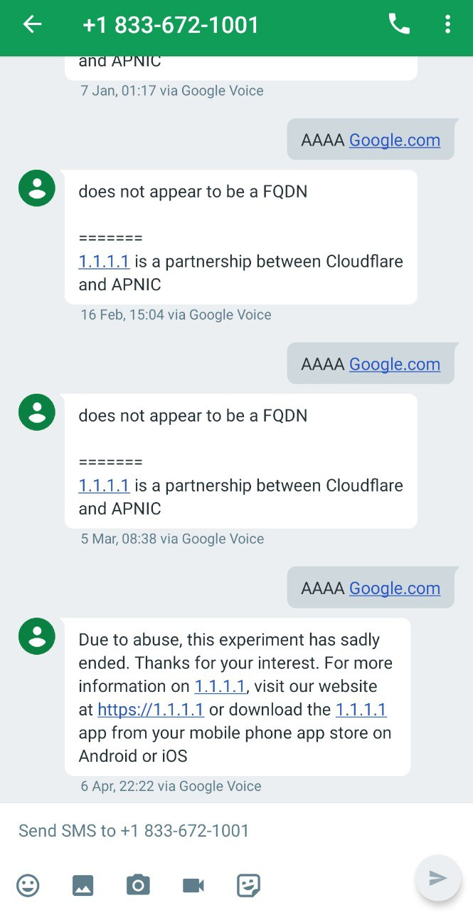
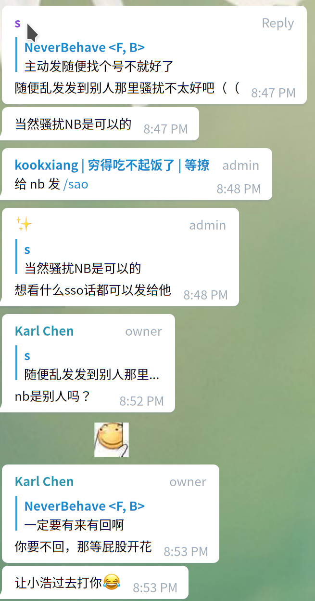
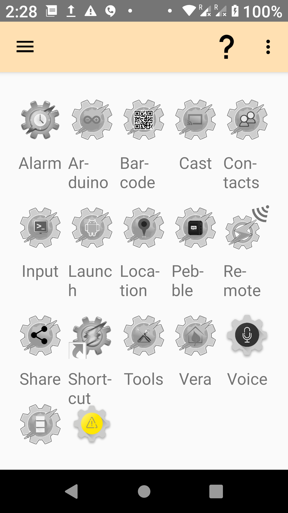
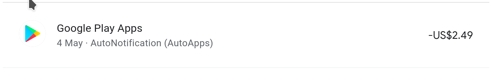
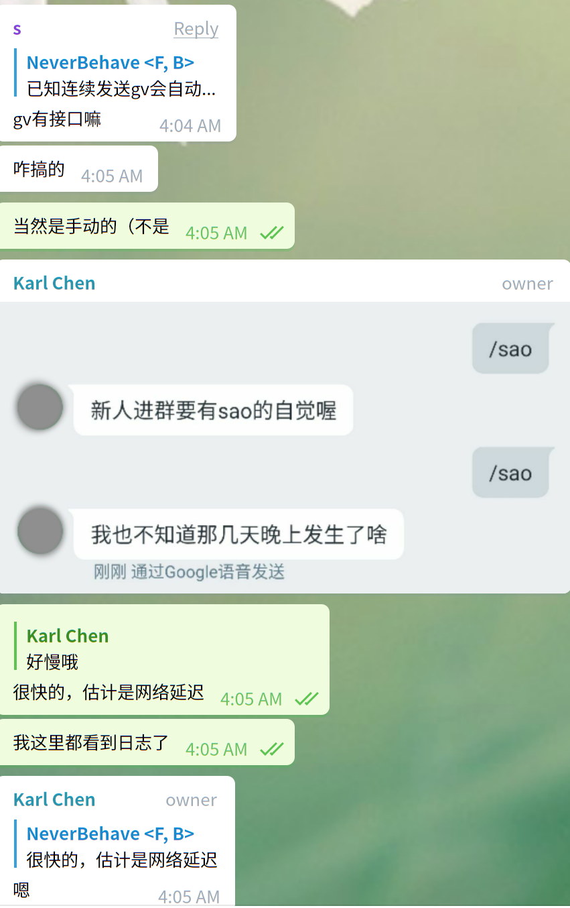

## 事故前提

偶然打开某个骚群, 发现有人抱怨自己的 `Google Voice` 被回收了, 并讨论如何保号

据说要主动发送, 并且还要收消息, 这样的服务第一时间想到的是`1.1.1.1`的 DNS 查询, 但是据说因为被滥用已经关闭了 <https://developers.cloudflare.com/1.1.1.1/fun-stuff/>

不过反正 Google Voice 互相发送不要钱, 为什么不随便找个人发呢?

但是到时候一个一个回复太累了, 好烦哦, 有没有什么可以自动回复的东西啊, 对哦, 回复一言好了, 但是自动化呢?

这时候我想起了 Tasker

## 动手时间

Tasker 是我当时为了挂国内短信卡而购入的一款自动化软件, 详细历史可以看这一篇[华为短信机](./tasker-messenger.md)

先确定一下思路: 我目前的 Google Voice 是由 Hangout 接管的, 如果我可以通过读取通知获得内容, 判断是否触发自动回复内容, 然后通过其通知栏快速回复按钮回复是不是就好了?

答案是不行.

因为 Tasker 虽然能够直接读取通知, 但是却没有相应的动作去触发回复按钮, 或者说这个通知触发本身也很奇怪: 很多时候根本匹配不到

难道是因为软件年久失修, 作者不打算继续了?

继续寻找, 发现作者确实做了一个拓展, 用来实现自动回复 Google Voice 的功能, 叫做 [Touchless Chat](https://joaoapps.com/touchlesschat/)

但是这个在 15 年的时候就停止了, 但是作者在帖子某个帖子下面回复说, 为了方便维护, 转向一个系列叫做[AutoApps](https://joaoapps.com/autoapps/)

简单点来说, 大约就是把各个子功能单独强化并作为`Tasker`兼容的组件单独出售, 一开始让我确实感觉有点被欺骗, 但是单个组件支持看广告免费试用, 买断或者是集体订阅

行吧, 我 Play 刚好剩下一点余额, 就给你试试看

### Auto Notification

这一次主要用到的子功能是这个, 他可以和`Tasker`配合用于监听触发, 生成自定义的通知横幅, 以及自动完整横幅内容填充(本本章用到的功能)

完整配置文件可以查阅<https://github.com/NeverBehave/tasker-config#readme>

一言语料: <https://gist.github.com/NeverBehave/606d7e14436187b4d45e8657fafd40ab>

## 效果

在免费试用期测试完整以后便买断了这个组件

注意一下各个组件价格还不一样的, 有些功能少的价格便宜, 多的也就贵一点, 看论坛整体生态还是不错的, 还支持不少第三方插件

### 已知问题

因为是监听通知, 如果同时有多个人发短信过来, 有概率会无法执行

如果你也想试一下的话, 请点击下方**计算**按钮**两次**获取真实号码试试看吧:

自动回复指令: `/sao`, 不要多也不要少哦

`(`{{ front }}`)`{{ middle }}`-`{{  end }}

<button @click="reCal">计算</button>

就酱~

