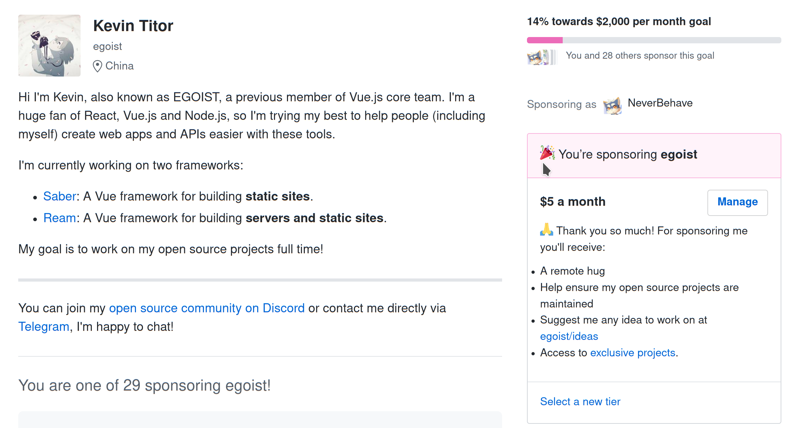

过了这么久, 还是迁移了博客...

目前使用的是<https://saber.land>

## 如果你在访问并非本文章的链接时跳转到这个页面

我在这次迁移的过程中, 删掉了我觉得之前写的没什么意义的文章

如果你想看这些文章的存档, 可以到仓库的 [archive 分支](https://github.com/HomeofNever/Blog/tree/archive-2017) 查找

## 为什么我又迁移了?

这篇文章其实总结的很好了

https://www.h404bi.com/blog/2019/04/recent-changes-of-my-site

我现在这个博客很多也是借鉴这边的修订逐步迭代的, 但是一定要我来说的话, 主要是这一点

**用`Vue`来自定义博客和文章**

相比与`hexo`, 我觉得组件式, 尤其是我熟悉的框架, 可以给我带来更好的体验

`Vuepress`在本文撰写之时并没有活跃维护, 这也给了我很好的理由使用`Saber`

具体架构可以看 https://github.com/HomeofNever/Blog/#readme

这个过程拖了太久了, 但是总算现在算是基本落地成功. 去给作者打赏以当庆祝 

---

 

整体体验还行, 顺便试试看新开的`Amex`卡

不想管主题先了, 先把最近想写的都写了Orz