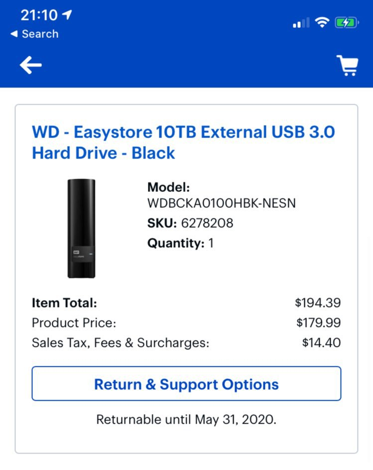
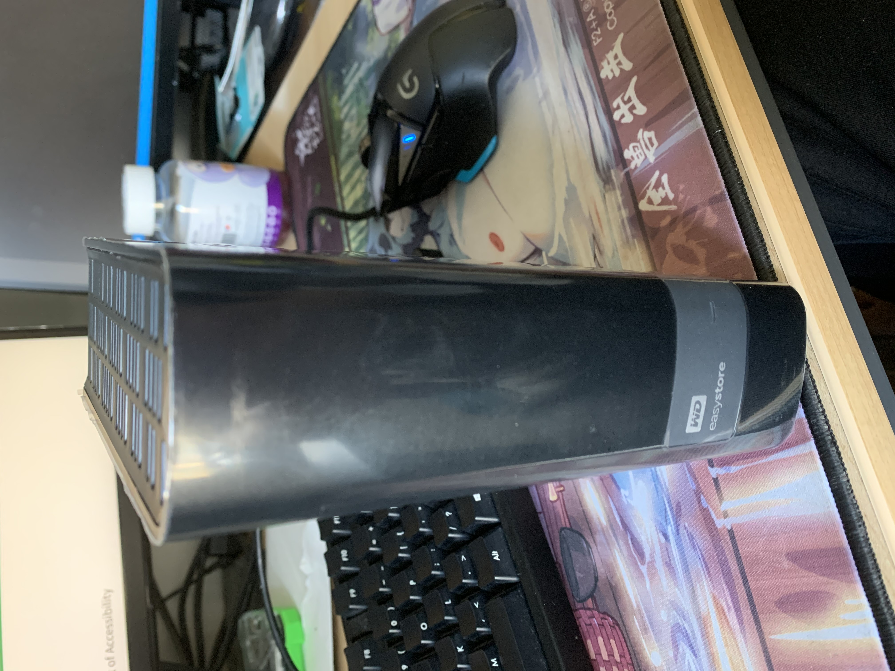
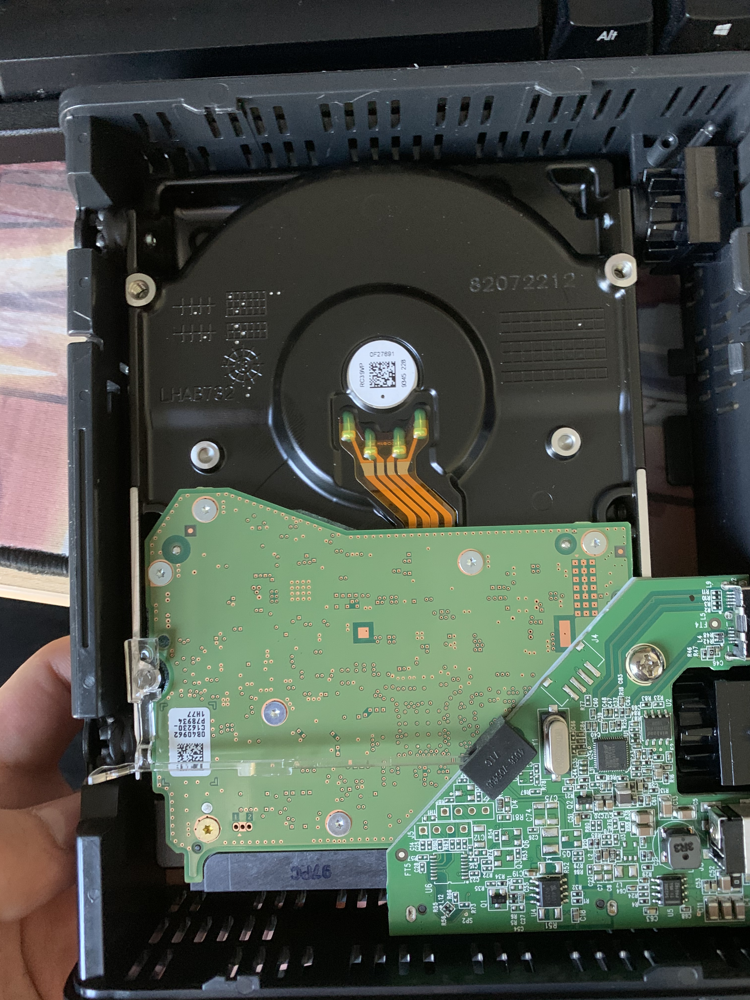
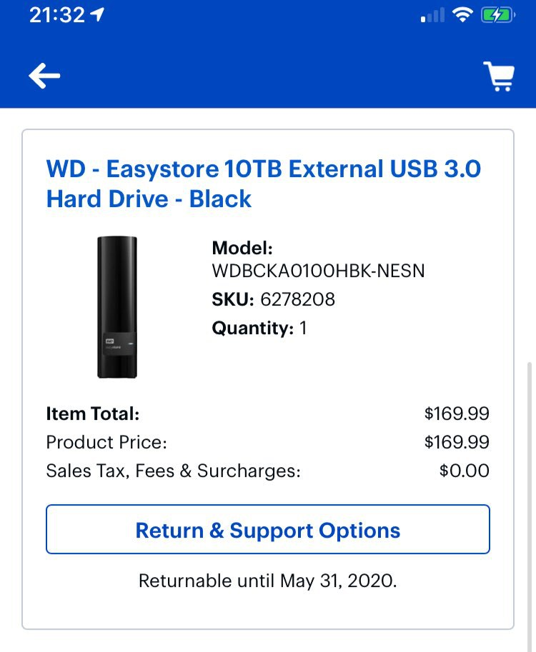

### 第二波

提前说一下, 这一波亏了, 买的是 10tb 的WD elements

我平时购买会在什么值得买看看历史报价, 预期心理价位目前是:

- 140刀 8t 税后
- 170刀 10t 税后
- 200刀 12t 税后

**这一次在BestBuy最骚的就是, 179刀卖了以后, 过两天169刀开卖** (详见第三波)

加上税以后一口老血喷出来......
不说了, 先列一下型号:

- WD Element
  - 194.79/10T => 19.48/T
  - WD100EMAZ
  - US8SAL100

这一次我没测速, 失误, 直接插进蜗牛和希捷的组了`RAID1`

#### 开箱

<Tweet id="1258465154670436353" :options="{conversation: 'none'}" />

#### 拆

还是一样的好拆

---

### 第三波

还在路上, 托人从免税州带过来的, 先晒一下订单:

列一下数据, 后续补充
- WD Element
  - 169.99/10T => 17.00/T
- WD Element
  - 199.27/12T => 16.61/T
- WD Mybook
  - 178.98/10T => 17.90/T

## 总结

总储存: 60 T 总花费: 1061.61 USD

算上杂七杂八的信用卡返现和返利网站返现, 算整体百分之五

实际花费: 1008.53 USD

平均 16.81 USD/T

### 多出来的盘?

希捷的盒子基本上是废了, 虽然说做工最好, 丢了之前从垃圾堆里捡到的, 160G, 跑了3w8小时还没啥问题的西数企业盘进去

其他西数盒子就把之前的希捷的1tb, 3tb盘丢进去了

~~感觉这辈子都不差盘用了~~

--- 

未完待续

