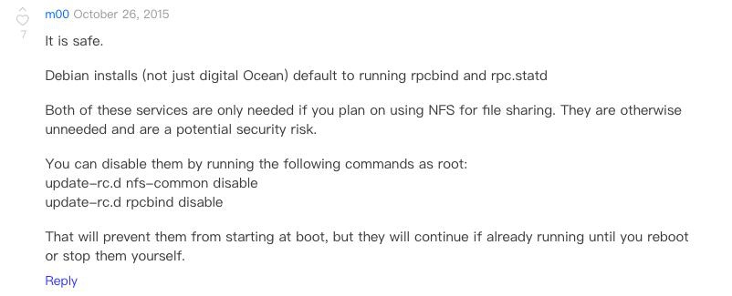
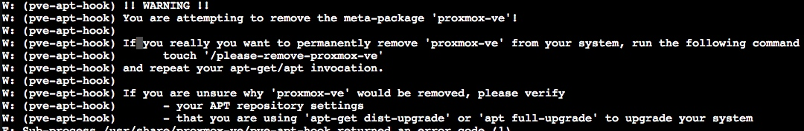

最近收到一封Abuse说机器有被利用DDOS的问题，原文部分内容是这样的：

```
> the Portmapper service (portmap, rpcbind) is required for mapping RPC
> requests to a network service. The Portmapper service is needed e.g.
> for mounting network shares using the Network File System (NFS).
> The Portmapper service runs on port 111 tcp/udp.
> 
> In addition to being abused for DDoS reflection attacks, the
> Portmapper service can be used by attackers to obtain information
> on the target network like available RPC services or network shares.
> 
> Over the past months, systems responding to Portmapper requests from
> anywhere on the Internet have been increasingly abused DDoS reflection
> attacks against third parties.
> 
> Affected systems on your network:
> 
> Format: ASN | IP | Timestamp (UTC) | RPC response
>  xxxxx | xxx.xxx.xxx.xxx | 2018-06-19 03:37:37 | 100000 4 111/udp; 100000 3 111/udp; 100000 2 111/udp; 100000 4 111/udp; 100000 3 111/udp; 100000 2 111/udp;
```

检查了111以后发现是一个叫做`rpcbind`的玩意，但是谁搞的这玩意呢……不过先干掉再说

有点意思，看了一下这里：https://www.digitalocean.com/community/questions/is-it-safe-to-remove-rpcbind



OK，似乎可以删除。**但是已删除会连着Proxmox整个一起被干掉**，还好有一层确认（感谢）




解决方案在这里：https://forum.proxmox.com/threads/is-it-possible-to-disable-rpcbind-port-111-and-how-to-do-it.33590/

防火墙干掉111，或者是停用服务就好了。我选择了后者：

```bash
systemctl stop rpcbind 
systemctl disable rpcbind
```

Done.

