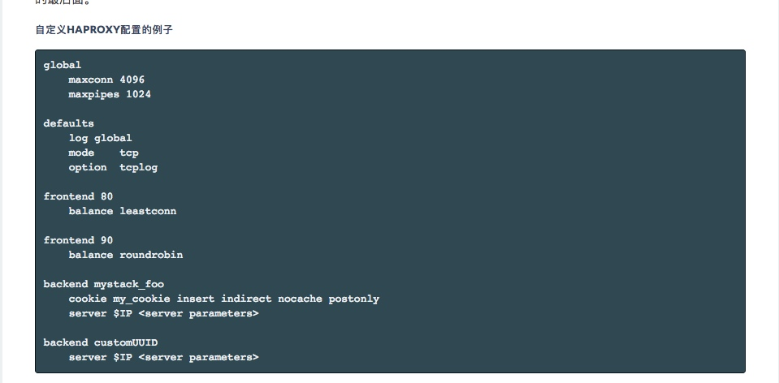
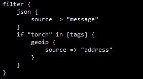
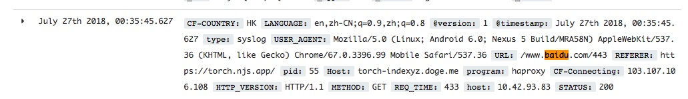
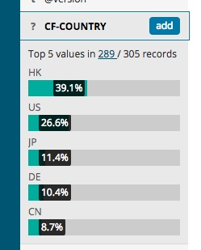

## 前言

**包含了两个内容，一个是加日志，另外一个是H2**

之前看 [@indexyz](https://blog.indexyz.me) 做了一下 ELK（Elastic Search，Logstash，Kibana）给 Nginx 记录日志，感觉 [Kibana](https://www.elastic.co/products/kibana) 看日志的效果真的还可以，便打算给自己的 Rancher 均衡负载做一个。然而……

## Rancher 的均衡负载

这玩意本身限制蛮多，首先是你要合并进配置的话……你不能直接改配置文件，他自己有一套管理而且 Rancher-LB 的`Dockerfile`是没有公开的。

我一直以为他的自定义cfg文件只能合并进`defaults`直到我看到了重新[这里](https://rancher.com/docs/rancher/v1.6/zh/cattle/adding-load-balancers/)~~！！下次看文档仔细一点啊喂！！~~:




原来是可以分块添加的，完美。

## Haproxy

既然是 Haproxy 做的，那就看看 Haproxy 能够怎么记录日志吧

### Redis

Indexyz 用了 Redis 做中继（日志丢进Redis，然后 Logstash 从里面读取），这样子防止 Logstash 爆炸丢日志（最佳实践）。我的话……懒一点

### Syslog

本身 Haproxy 有[向远程服务器丢日志](https://cbonte.github.io/haproxy-dconv/1.8/configuration.html#log%20global)的功能。然后里面是支持 Syslog 的。
完美！那就直接丢吧！ Logstash 也是原生支持！

#### Rancher DNS

诶等一下，我没有链接容器怎么办？难道每个配置文件里面都要手动写IP？其实每个服务容器都自动注册了一个唯一的地址，[看这里](https://rancher.com/docs/rancher/v1.6/zh/cattle/internal-dns-service/#ping-1)


### 配置文件例子

```
defaults
    mode http
    option tcp-smart-accept
    option tcp-smart-connect
    log logstash.elk:5000 len 65535 syslog
    log-format '{"STATUS": "%ST","Host": "%[capture.req.hdr(0),json(utf8s)]","REQ_IP": "%ci","CF-Connecting": "%[capture.req.hdr(2),json(utf8s)]","CF-COUNTRY": "%[capture.req.hdr(1),json(utf8s)]","HTTP_VERSION":"%HV","SSL_VERSION": "%sslv","URL": "%HU","REFERER": "%[capture.req.hdr(4),json(utf8s)]","USER_AGENT": "%[capture.req.hdr(5),json(utf8s)]","LANGUAGE": "%[capture.req.hdr(3),json(utf8s)]","METHOD": "%HM","REQ_TIME": "%Tq"}'

frontend 443
  mode http
  capture request header Host len 40
  capture request header CF-IPCountry len 20
  capture request header CF-Connecting-IP len 50
  capture request header Accept-Language len 50
  capture request header Referer len 200
  capture request header User-Agent len 200

frontend 80
  capture request header Host len 40
  capture request header X-Forwarded-For len 50
  capture request header Accept-Language len 50
  capture request header Referer len 200
  capture request header User-Agent len 200
```


#### 关于Capture
1. `IPCountry` 需要自己设定在 Cloudflare 设置 `Page Rule`，不过呢，Logstash 本身也有这个功能：
2. 因为 Haproxy 本身呢……如果你要记录 Header 你必须要自己现在 Frontend 里面加上。这个的话就是看自己需要什么了。


参考资料：

- https://github.com/logstash-plugins/logstash-patterns-core/blob/master/patterns/haproxy
- https://cbonte.github.io/haproxy-dconv/1.8/configuration.html#8.2.4

## ELK
这里就直接上 Docker-compose

```
version: '2'
services:
  Kibana:
    image: docker.elastic.co/kibana/kibana:6.3.1
    environment:
      ELASTICSEARCH_URL: http://elasticsearch:9200
    stdin_open: true
    tty: true
    links:
    - Elasticsearch:elasticsearch
    labels:
      io.rancher.container.pull_image: always
  Elasticsearch:
    image: docker.elastic.co/elasticsearch/elasticsearch:6.3.1
    environment:
      discovery.type: single-node
    stdin_open: true
    volumes:
    - /data/elk/elasticsearch:/usr/share/elasticsearch/data
    tty: true
    labels:
      io.rancher.container.pull_image: always
  Logstash:
    image: docker.elastic.co/logstash/logstash:6.3.1
    stdin_open: true
    volumes:
    - /data/elk/logstash/:/usr/share/logstash/pipeline/
    tty: true
    links:
    - Elasticsearch:elasticsearch
    labels:
      io.rancher.container.pull_image: always
```

- 因为是 bind mount，记得给权限`chown 1000:1000`
- Logstash 没有配置文件会启动失败，配置文件名是`logstash.conf`
- `Kibana`的 Web 端口是`5601`

## Logstash

先放配置文件：

```
input {
  udp {
    port => 5000
    type => syslog
  }

  tcp {
    port => 5000
    type => syslog
  }
}

filter {
  grok {
    match => {"message" => "<%{NUMBER}>%{SYSLOGTIMESTAMP} %{SYSLOGPROG}: %{GREEDYDATA:message}"}
    overwrite => ["message"]
  }
  json {
    source => "message"
    remove_field => ["message"]
  }
}

output {
  elasticsearch { hosts => ["elasticsearch:9200"] }
  stdout { codec => rubydebug }
}
```

- `grok` 是因为 Haproxy 本身会遵守规则在里面有一段 SYSLOG 的前缀，JSON Parse 之前要先剔除
- 注意下 Logstash 各个版本版本语法变化很多，每次都因为看旧的例子被坑到（比如`match`，以前是数组）。参考资料尽量看官方，或者**一定要注意回复时间**

这样子出来以后的效果如图：




更多的话就让大家自己去摸索啦


## 还有些什么没做呢

Haproxy 启动的日志我没处理，这个时候就会有`_jsonparsefailure`标签，有兴趣的自己写一下吧


## 关于 H2

因为 Cloudflare 默认上传只有 100M ，这……网盘可以直接GG了。然而如果直接把 Haproxy 放在前面那就要尽可能多做点优化啦。比如说 http2

### 然而

Bind 指令是Rancher自己生成的！如果你要启动 http2 必须要在 Bind 后面加上选项 [alpn](https://cbonte.github.io/haproxy-dconv/1.8/configuration.html#5.1-alpn)

你说那我可以自己构造覆盖？但是证书是Rancher部分管理的，除非你打算自己写文件名（也不是不行）。

直接覆盖文件不要想，前面说过rancher每次启动容器都会覆盖掉这个部分。

## 关于 Rancher-lb

在查资料的时候发现 Rancher v1.6 默认使用的 Load Balancer 镜像使用的 Haproxy 是有漏洞的（1.8.x)。还是一个`Crit`级别（需要开启h2，所以没有推送更新？）。虽然官方已经有更新版本了但是默认 Rancher 会锁死版本号（GG）所以不会更新

这个时候就要自己去`系统管理->系统设置->高级设置`里面改使用的版本


最新的 Rancher-lb 版本截至目前是`0.9.4`
可以在这里查看[最新地址](https://hub.docker.com/r/rancher/lb-service-haproxy/tags/)

改完以后记得去升级（会有提示）


