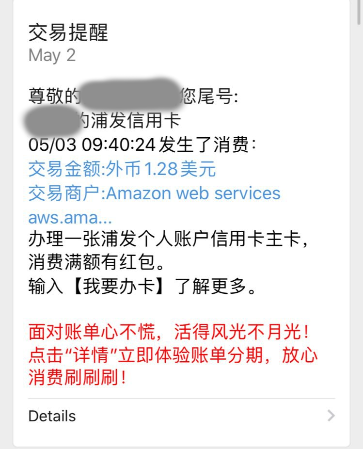

## 事故前提

我开始用`aws lambda`的时间大约是它还只有`node v8`运行时的时候, 主要其免费的额度确实相当的诱人, 加上学生赠与的免费`credit`, 香的一批

直到我发现`API Gateway`不在免费额度抵扣范围内(?疑惑), 虽然现在是的了

其中我还用过一次他的`LightSail`, 也是被[@indexyz](https://blog.indexyz.me) 拉上贼船的. 当时是他从淘宝买了一些每个帐号只能用两张的券, 结果额度扣完了没发现, 直到结算到我信用卡的时候才发现了

总共扣了我大几十刀的样子, 很难受, 而且也让我对绑定额度太高的信用卡上去有了阴影(要不是及时停下来了). 没有额度的情况下, `lambda`虽然每个月都有免费额度, 流量和`API Gateway`依然计算费用. 目前每个月我都会看到几块钱的扣费



唉, 好不爽哦

刚好这个时候, [@zhaofeng](https://zhaofeng.li) 和我说:

> 我的小东西现在都放在 fission 了

[fission](https://fission.io)? 这是啥

### 题外: 为什么不用 Netlify/Vercel

大部分放在`lambda`上面的东西是一些实验品, 机器人一类

在`Vercel`出来之前, netlify, firebase的function我感觉都不尽人意, 处理起来很不舒服

但是在经过[这个issue](https://github.com/DIYgod/RSSHub/issues/4334)后, 我觉得`Vercel`的处理确实很舒服, 算是目前打包上线体验比较好的平台了. 主要问题应该就是免费额度有点小

## About Fission

这里引用 [@zhaofeng](https://zhaofeng.li) 的三句话

> self-hosted aws lambda，不需要 build 任何 image  

> cold-starts under 100ms  

> 然后比 aws lambda 简单很多

它的做法是用提前准备好的 runtime container （和 lambda 差不多），然后挂载你的代码

于此同时, 相似功能的还有[openfaas](https://www.openfaas.com/)，不过不推荐，因为还是需要针对每个`function`构建单独的镜像

**在继续之前请注意, fission 是基于k8s的, 如果你没有集群, 往下可以跳过了(别打我quq)**

~~当然, 你要是不差钱的话, https://cloud.google.com/anthos/gke~~  
> 如果你没有懂这个梗的话:https://web.archive.org/web/20190717144230/https://cloud.google.com/anthos/pricing

### 安装

https://docs.fission.io/docs/installation/

> @zhaofeng  
> 它的 yaml 也是 helm template 生成的，有点毒  
> 好多 pod 都没有 namespace  
> 即使你 helm 设了 --namespace，它出来的 manifest 还是有毒的  
> 它原来的初衷是让你 kubectl apply -n yourns 让 kubecrl 填充剩下的 ns，不过现在 kubectl 不让你这么做了  
> 其中指定的 namespace 和你 -n 里的 ns 不同会报错  

就这样~~和NPC对话后~~我获得了一份典藏的`Makefile`

```makefile
rendered.yml: values.helm.yml
    helm template fission \
        --namespace fission \
        -f values.helm.yml \
        https://github.com/fission/fission/releases/download/1.8.0/fission-all-1.8.0.tgz \
    | yq -Y 'if has("metadata") and (.metadata | has("namespace")) then . else .metadata.namespace="fission" | . end' > rendered.yml

.PHONY: clean
clean:
    rm -f rendered.yml
```

anyway, 生成出来的`rendered.yml`可以食用了w

#### Ingress 设置

虽然`fission`支持给每个`function`生成自定的`ingress`, 这样带来的问题是, 我没有设定`dns`啥的配合

所以目前我全部的函数都挂在到一个`ingress`

#### 本地 CLI

fission将会直接读取`KUBECONFIG`并连接到集群, 建议使用`CLI`连接 

https://docs.fission.io/docs/installation/#install-fission-cli

### 迁移一个目前已经有的项目

行吧, 先上手迁移一个项目试试: https://github.com/abusetelegram/xixi-haha

分成两个部分, 一个是`api`, 返回`yiyan`

还有一个是`Telegram Bot`

指南: https://docs.fission.io/docs/languages/nodejs/

简要提及一下过程:
- [创建环境](https://docs.fission.io/docs/languages/nodejs/#add-the-nodejs-runtime-environment-to-your-cluster)
- 创建`PKG`
  - `fission package create --src release.zip --env nodejs --name xixi-haha-bot`
  - 将项目打包进`zip`, 指定使用环境和名字, 环境对应的`builder`将会运行并执行打包
  - 你可以自定义这个过程, 打包属于你自己的`builder`[参见](https://docs.fission.io/docs/languages/nodejs/#modifying-the-nodejs-runtime-image)
- 创建`fn`
  - `fission function create --name xixi-haha-bot --pkg xixi-haha-bot --env nodejs --entrypoint fission`
  - 指定名字, 打包好的包, 环境以及入口
- (可选)测试
  - `fission fn test --name xixi-haha-bot`
  - 直接测试触发
- 部署`httptrigger`
  - `fission httptrigger create --method POST --url "url/you/want" --function xixi-haha-bot --name "xixi-haha-bot-post-route"`
  - 指定路径, 创建好的`fn`, 名字即可
- (可选)查看日志
  - `fission fn log --name xixi-haha-bot`

几行下来, 一个完整的函数就上线了, 默认超时, cpu, 内存以及更多`cli`操作就不再叙述了

最重要的是, 可以配合`release`, 直接传入`url`下载打包好的应用更新包, 食用起来还是很舒服的

#### 入口

稍微和lambda有点不一样, 没有`callback`,标准的传入`res, req`, 要求一个方法而不是对象

具体区别可以对比[fission.js](https://github.com/abusetelegram/xixi-haha/blob/master/lambda/fission.js)和[lambda.js](https://github.com/abusetelegram/xixi-haha/blob/master/lambda/lambda.js)

#### 坑

顺便讲几个小坑:

- Web界面还不是很完善
- 暂时没有找到`process.env`的注入方式
  - 目前我的解决方案是用`dotenv`, 但是问题是代码挂载的位置[并不是根目录](https://github.com/fission/fission/blob/aa8c27fd5d9a1b92062d87e73a0e96f1c9b7ba7a/environments/nodejs/builder/build.sh#L3), 所以需要强行指定一下. [解决方案](https://github.com/abusetelegram/xixi-haha/blob/d7b288aa285a940eece862ce97abb006b3be9ff1/lambda/index.js#L3)


好了, 赶紧把卡解绑了, mmp