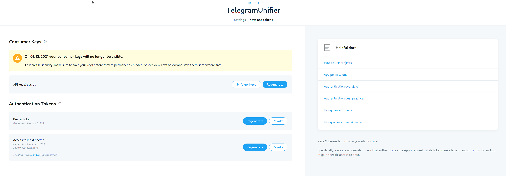

## 2023更新

仓库被Github Ban啦！应该是Github Action滥用的问题。但是我也已经从推特转走了，平时都在Mastodon。再见，小蓝鸟！

---
--原文分割线--
---

> 如果你想直接看成品: https://github.com/NeverBehave/Tweet2Telegram

## 剧情前提

推特上有太多好 ~~(毛毛)(色)(不你什么都不知道)~~ 图/视频了, 然而每次想找点回来的时候却...翻起来好麻烦啊

然而每次保存下来好麻烦, 要是点赞了以后可以自动保存下来就好了

于是我又动起了IFTTT的念头...因为IFTTT也有推特点赞转发啊! 我之前还做过一期[如何用IFTTT配合推特转发到个人频道](./customize-telegram-twitter-ifttt-connection.md)；甚至还买了Pro

但是如果是这样的话, 文章标题怎么感觉有点不对呢...?

### IFTTT的困境

IFTTT这个东西嘛, 简单点的就算了, 这回我们的需求是: 

1. 获取点赞的推文
2. 解析其中所有的视频/图片/链接
3. 转发到Telegram频道

然而呢, IFTTT

1. 其中的图片/视频链接不是直链
2. Webhook有频率限制
3. **甚至, IFTTT似乎实现错了这个功能**(后文详述)

直链这个解析实在是难以描述, 如果不通过推特官方的API: 他默认做了很多对爬虫不友好的操作

一番测试下来发现效果真的很差, 很容易错过点赞

于是...那就看看推特的API然后自己做一套吧

## 正文

### 申请API

首先, 我们需要申请一下开发者API, [申请链接](https://developer.twitter.com/en/apply-for-access)

在申请的时候他会让选择你的用途并描述你要做什么, 至少`200 characters`, 不是`words`. 也就是说差不多2-3句话差不多了

这个做完以后就等着邮箱发信给你, 确认一下. 我刚填完就收到了邮件, 基本上体验还好

### 创建APP

一开始他默认会给你创建一个项目, 然后你在里面可以创建你的第一个APP. 但是注意一下, 除了`API_KEY`和`API_SECRET`, 他还有一个`ACCESS_TOKEN`. 这个对应的是用户的数据访问, 也就是说你这个APP代表的是哪个用户做事情. 我们目前是要获取自己帐号的点赞列表, 所以直接看下面`Authentication Tokens` 获取自己的就好

### Github Action

然后就是我们的重头戏上场: https://github.com/NeverBehave/Tweet2Telegram

默认15分钟获取一次, 目前来看效果不错

甚至说实话, 我觉得转发也可以改成这个, 不知道好到哪里去了:

- 不需要麻烦的获取链接跳转再替换
- 视频/图片原生就在Telegram, 无需Web Preiew

写完以后感受: 推特的API其实还蛮舒服的, 当然如果只是个人使用的话. 一开始被`IFTTT`坑的不要不要的, 现在看来其实还好

这里, 我想提一下这个很有意思的API问题 (Aka IFTTT干的好事)

#### `since_id`

这是我也踩了一脚坑, 意识到以后重新观察了一下`IFTTT`的行为, 估计是一样的

获取点赞列表的时候, 其中一个参数是叫做`since_id`([官方文档](https://developer.twitter.com/en/docs/twitter-api/v1/tweets/post-and-engage/api-reference/get-favorites-list)), 这个东西的意思是说返回所有**从这个`ID`开始的所有推文**. 放在这个上下文是不是很容易理解为**如果你点赞了的一条推文, 我记住它, 那么下次我获取新的点赞的时候, 给这个推文的`ID`, 就可以获取从这个点赞以后的推文了**

不是的!!!!!! 这个的意思纯粹是说**按照时间顺序, 比你给的这个`ID`新的所有你喜欢的推文**

所以当你点赞了一条今天发送的推文, 然后去点赞了一条昨天发送的推文, 那么你就获取不到这个**新**的点赞了

我发现IFTTT就有类似的行为, 他总是检测不到一些点赞, 估计他的**新点赞的推文**也就是靠这个ID判断的, 实际上是错的!

但是实际上API文档里面写的很清楚了是时间顺序, 所以还是自己傻逼了, 抚额

## 后言

大部分的参数在项目里面提供了, 我就不在这里重新描述了, ~~其实这就是水文~~

然后就是这个IFTTT的bug, 不知道去哪里报一下

