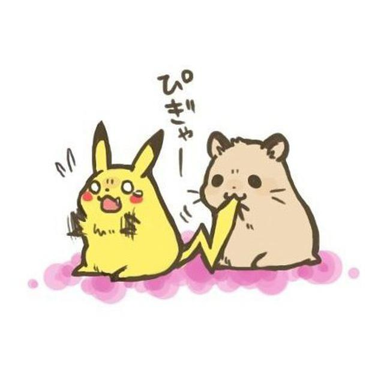
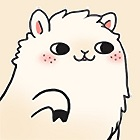
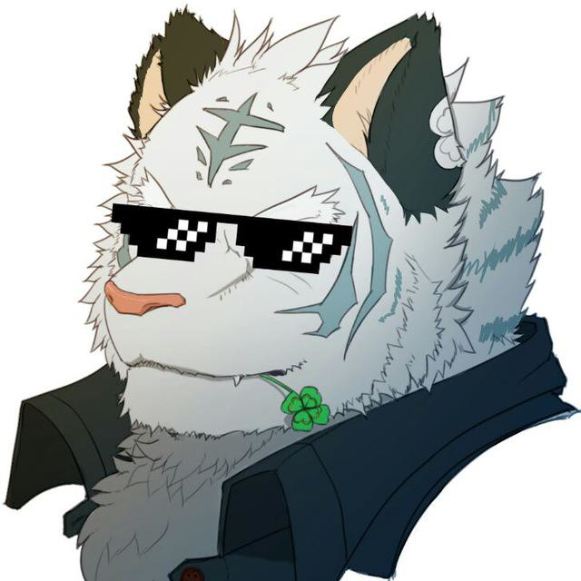
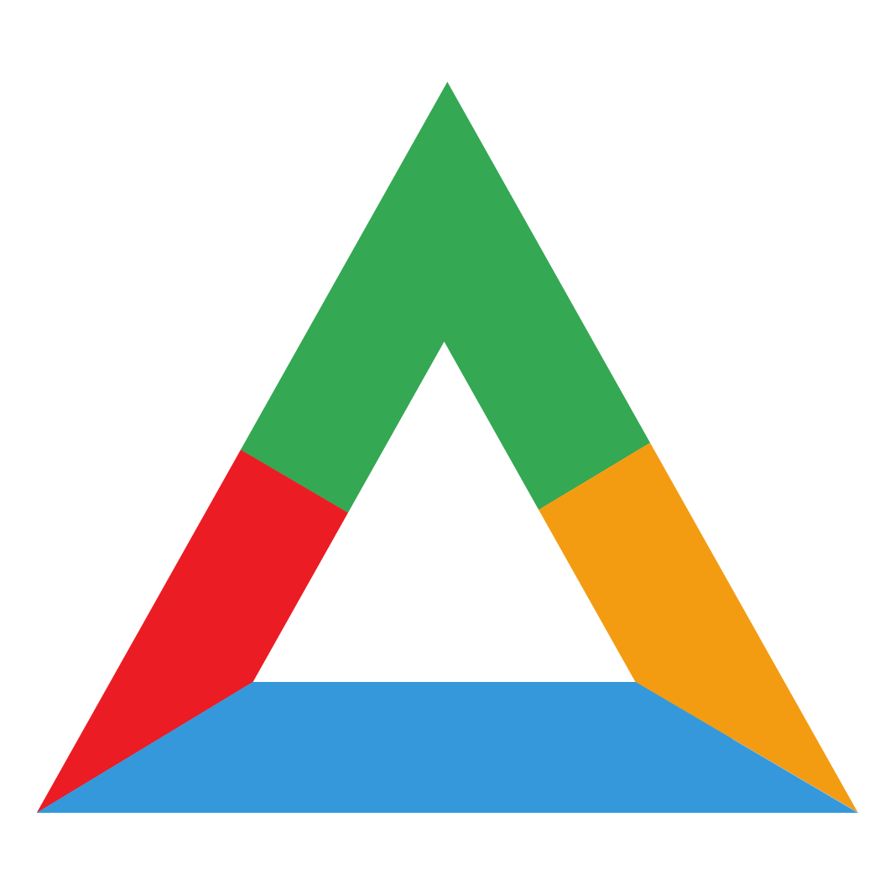
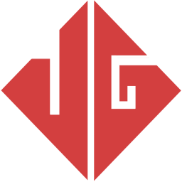
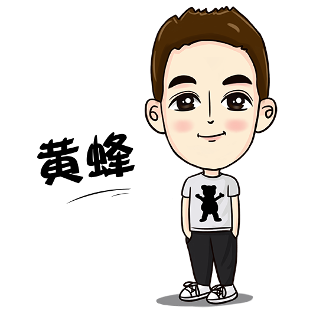

这里应该是一些一起玩的小伙伴们，他们都超级棒的!!1

不妨也去溜达溜达 XD

|Avatar|Site|Slogan|
|:-:|:-:|:-:|
||[Genteure](https://www.genteure.com)|宅急送队长随便说|
||[Nimaqu](https://blog.nimaqu.com/)|除了水群啥都不会
||[灰灰](https://huihui.moe)|好诶，是 huihui
||[LWL 的自由天空](https://blog.lwl12.com)|Hi, LWL12
||[neoFelhz's Blog](https://blog.nfz.moe)|Nothing can be done without paranoia.
||[Indexyz Blog](https://blog.indexyz.me)|Sharing light, even in death.
||[奶冰の冷藏室](https://milkice.me)|Maybe a way to explore the world?
||[Anankke's Blog](http://an.ank.moe)|Into The Abyss.
||[超能小紫 mokejay](https://www.mokeyjay.com/)|PHP初学者 // ACG爱好者 // 专业学渣 // 余业萝莉控
||[1A23 Studio](https://1a23.com/)|We Create.
||[DCC 的小窝](https://www.dcc.cat)|长夜才开始，黑暗中请记得太阳的模样，沉默中不要为魔鬼歌唱。
||[KK 的博客](https://ikk.me)|code just like a piece of shit.|
||[Vigorous Pro](https://www.wevg.org)|这是一个从零开始的世界|
||[Zohar's Blog](https://www.iwch.me/)|The Most Important Thing in My Life is Freedom|
||[Sukka's Blog](https://skk.moe)|童话只美在真实却从不续写|
|头|[青空之蓝](https://ixk.me)|站在时光一端，回忆过往记忆|
||[天空之边](https://liyin.date)|用心探知天空的边界|
|头|[无垠](https://flyhigher.top)|飞翔的天空无限大|
||[黄蜂说](https://www.sjy.im/)|一名互联网从业者的自留地，分享自己的所见所得，自认为过程比结果重要。|

# 交换友链

如果你想要加我的话，这里是一些基本信息你可以直接拿走：

- 名字：NEVER迷の小窝
- 简介：没有简介的迷の生物
- 头像：avatar@never.pet 的 [Gravatar](https://www.gravatar.com/avatar/8f253ca9681abc8072a3a1fc6dde8f8f)
  - <a v-bind:href="my">我的头像</a>
  - [使用说明](https://en.gravatar.com/site/implement/images)
- 背景图：可以使用以下图片
  - <a v-bind:href="eva">EVA</a>
  - <a v-bind:href="neko">Neko</a>

你可以到这个博客的仓库pr提交你的信息

